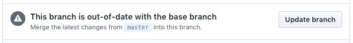

## 提交问题

如果您有关于如何使用muaCloud的问题，请加入我们的[rocket chat频道][rocketchat]或[论坛][forum]。

### 指南
* 使用我们的[模板][template]报告问题，它们包含我们追踪问题所需的所有信息。
* 此仓库仅适用于muaCloud Android应用程序代码的问题。其他组件的问题应报告到各自的仓库：
    - [muaCloud core](https://github.com/owncloud/core/issues)
    - [oCIS](https://github.com/owncloud/ocis/issues)
    - [iOS客户端](https://github.com/owncloud/ios-app/issues)
    - [桌面客户端](https://github.com/owncloud/client/issues)
* 首先搜索[现有问题](https://github.com/owncloud/android/issues)，可能您的问题已被报告。

如果您的问题似乎是错误，并且未被报告，请打开一个新问题。

请帮助我们最大限度地利用时间修复问题和添加新功能，请勿报告重复的问题。

[template]: https://github.com/owncloud/android/tree/master/.github/ISSUE_TEMPLATE
[rocketchat]: https://talk.owncloud.com/channel/mobile
[forum]: https://central.owncloud.org/

## 贡献源代码

感谢您愿意为muaCloud贡献源代码，这真是太好了！

在我们能够将您的代码合并到muaCloud Android应用程序之前，请查看[贡献指南][contribution]。

### 指南
* 使用以下分支名称之一在特性、修复、改进或技术增强分支中贡献您的代码：

    - ```feature/feature_name``` → 应用中的新功能
    - ```fix/fix_name``` → 修复问题或错误，总是欢迎的！
    - ```improvement/improvement_name``` → 改进现有功能
    - ```technical/technical_description```  → 代码审查、数据库等技术改进

  请使用上述前缀，因为CI系统已准备好与它们匹配。确保您的特性、修复、改进或技术分支已更新到官方`android/master`中的最新更改，这将使我们在将您的代码与稳定代码合并之前有更好的测试机会。
* 完成代码后，启动pull request以将您的贡献合并到官方`android/master`中。
* 即使您拥有写入权限，也请继续使用pull request进行后续贡献。
* 重要的是要提到，muaCloud Android团队使用OneFlow作为分支模型。这非常有用且简单：

    * `master` 将保持为主分支。一切工作都将围绕它进行。
    * 特性分支：从`master`创建的新分支。一旦完成并满足DoD要求，将重新基础并合并到`master`中。
    * 发布分支：将像任何特性分支一样工作。在重新基础并合并到`master`之前，必须签署发布标签。
    * 热修复分支：从最新标签创建。一旦完成，必须签署标签。然后，重新基础并合并到`master`中。
    * 获取特定版本的方法是浏览标签。

      关于此的有趣[链接](https://www.endoflineblog.com/oneflow-a-git-branching-model-and-workflow)。

[contribution]: https://owncloud.com/contribute/

### 1. Fork并下载android/master仓库：

* 请按照[SETUP.md](https://github.com/owncloud/android/blob/master/SETUP.md)设置muaCloud Android应用工作环境。

### 2. 创建pull request：

注意：在您的更改被接受之前，您必须签署[CLA](https://cla-assistant.io/owncloud/android)！

* 从您的master分支创建新的特性、修复、改进或技术增强分支：```git checkout -b feature/feature_name```
* 注册您的更改：`git add filename`
* 在本地提交您的更改。请尽可能使用[Conventional Commits](https://www.conventionalcommits.org/en/v1.0.0/)为提交添加描述性消息。采用最简单的方法：
    - 特性提交：`feat: brief description of the changes performed`
    - 修复提交：`fix: brief description of applied fix`
    - 测试提交：`test: brief description of developed tests`
    - 任务提交：`chore: add calens file`

  使用```git commit -m "commit message"```提交
* 将更改推送到您的GitHub仓库：```git push origin feature/feature_name```
* 浏览至https://github.com/YOURGITHUBNAME/android/pulls并发起pull request
* 输入描述并发送pull request。

### 3. 使用master更改更新您的贡献分支：

可能您会不时看到以下消息。



要解决此问题并确保您的贡献分支与官方android/master保持更新，请执行以下步骤：
* 切换到您的master分支：```git checkout master```
* 获取并应用官方android/master分支的更改到您的master分支：```git fetch upstream``` + ```git rebase upstream/master```
* 切换到您的贡献分支：```git checkout feature/feature_name```
* 使用master重新基础贡献分支，以确保贡献提交位于master分支的最后提交之后，确保干净的提交历史：```git rebase master```
* 将分支推送到服务器：```git push -f origin feature/feature_name```

## 版本管理

为了检查或查看稳定版本，可以使用命令`git fetch --tags`获取所有可用标签，并使用命令`git tag`列出标签。标签`latest`也可用，指向最新发布的版本。

## 翻译
请通过[Transifex][transifex]提交翻译。

[transifex]: https://www.transifex.com/projects/p/owncloud/

## 行为准则
请阅读[muaCloud行为准则]。尊重和礼貌对待社区和工作人员的其他成员是共同开发更好产品的必要条件。

[muaCloud行为准则]: https://owncloud.com/contribute/code-of-conduct/
